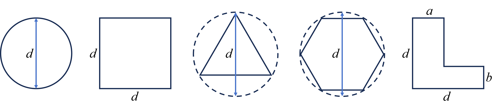
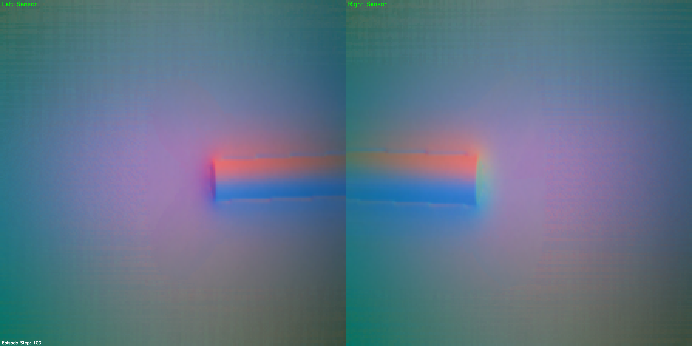
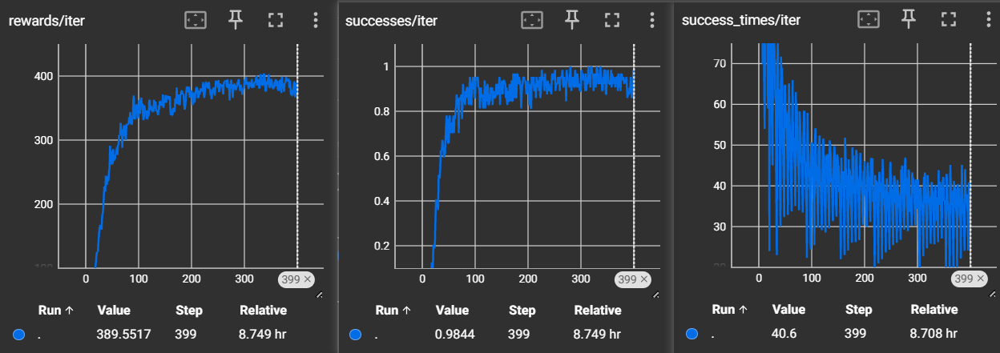
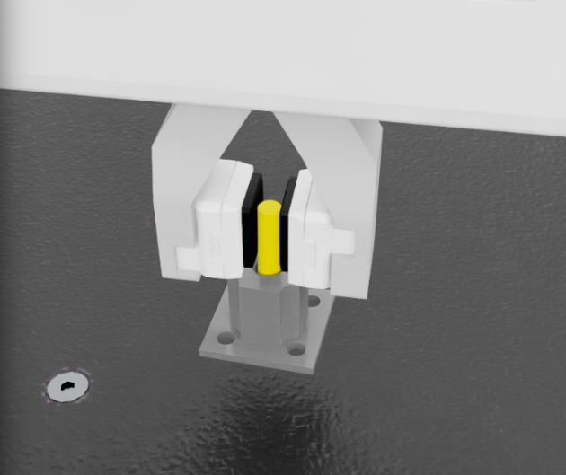
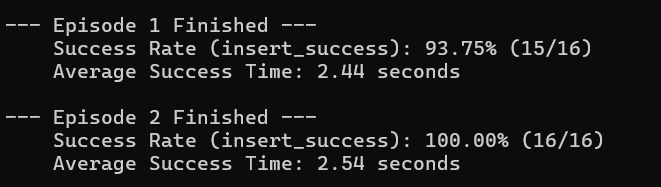
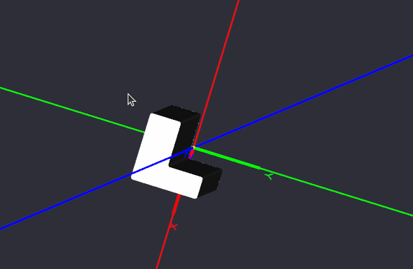
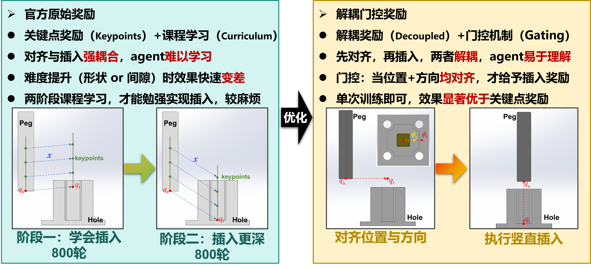
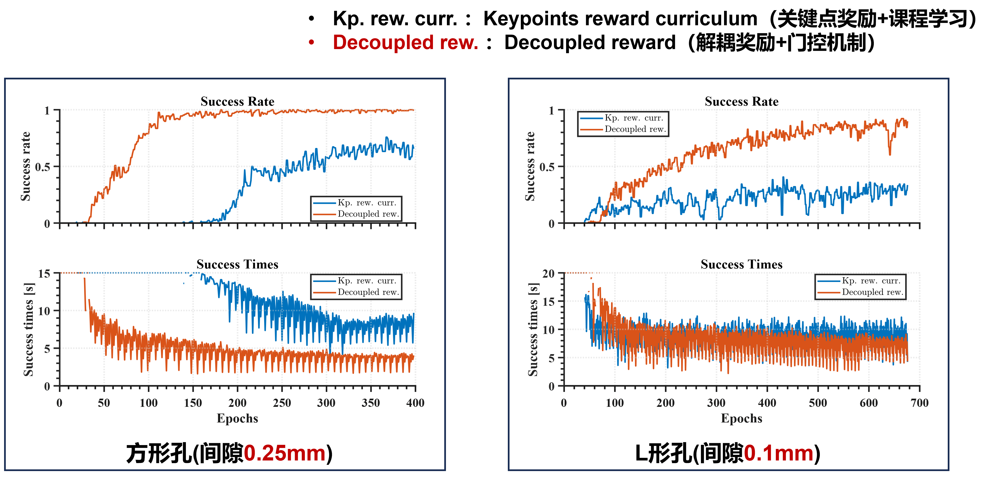
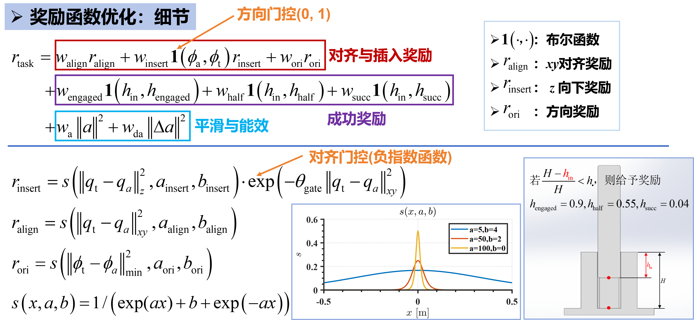

# VTLA
本项目依赖 TacEx - 构建，方便维护公共代码库。
为运行此项目，请先配置Tacex依赖环境， 核心项目代码位于以下目录
```
**/**/TacEx/source/tacex_tasks/tacex_tasks
```
该目录下 **factory_version_1** 与 **factory_version_2** 文件夹为实现 peg in hole 任务的两个版本。

**factory_version_1** 主要聚焦于触觉编码与视觉+触觉策略设计，**factory_version_2** 主要聚焦于奖励函数优化与强化学习算法设计。两套任务版本直接可以迭代共用。后续将引入 **factory_version_3** ，主要聚焦 sim2real 问题的解决。其余任务例如抓取、擦桌子等可参照该


## **Tacex 核心功能**:
- [GPU accelerated Tactile RGB simulation](https://github.com/TimSchneider42/taxim) via [Taxim](https://github.com/Robo-Touch/Taxim)'s simulation approach
- Marker Motion Simulation via [FOTS](https://github.com/Rancho-zhao/FOTS)
- Integration of [UIPC](https://github.com/spiriMirror/libuipc) for GPU accelerated incremental potential contact to simulate FEM soft bodies, rigid bodies, cloth, etc. in a penetration-free and robust manner
- Marker Motion Simulation with FEM soft body based on the simulator used by the [ManiSkill-ViTac challenge](https://github.com/chuanyune/ManiSkill-ViTac2025) that leverages UIPC


Checkout the [website](https://sites.google.com/view/tacex) for showcases and the documentation for details, guides and tutorials.


## Installation
> [!NOTE]
> TacEx currently works with **Isaac Sim 4.5** and **IsaacLab 2.1.1**.
> The installation was tested on Ubuntu 22.04 with a 4090 GPU and Driver Version 550.163.01 + Cuda 12.4.

**0.** Make sure that you have **git-lfs**:

```bash
# Need it for the USD assets
git lfs install
```

**1.** Clone this repository and its submodules:
```bash
git clone --recurse-submodules https://github.com/DH-Ng/TacEx
cd TacEx
```

Then **install TacEx** [locally](docs/source/installation/Local-Installation.md)
or build a [Docker Container](docs/source/installation/Docker-Container-Setup.md).

# Peg In Hole 任务说明

`factory_version1`,`factory_version2`均加入了`TacEx`对夹爪指尖的`GelSight`进行触觉仿真，并利用`TacNet`网络处理原始触觉图像得到三维力信息，并且将其作为观测obs和状态state），`factory_version1`与`factory_version2`的env实现略有差异，其中`factory_version2`结合了全新的奖励函数（对齐插入解耦+门控机制）,`factory_version1`结合了新的触觉融合策略.后续将适配不同的孔形（圆形、方形、三角形、六边形、L形），形成一个更加全面和完善的Peg-in-hole任务RL仿真训练环境。

同时考虑到后续可能针对Peg-in-hole任务设计专门的benchmark（涵盖5种孔形，每种孔形若干公差间隙：2mm-0.5mm-0.1mm-0.02mm），所以代码在设计时尽量考虑了可扩展性、非破坏性与孔型管理，尽管这可能导致代码略显冗长。

## 任务定义

下表给出了所有的孔型（形状+间隙）定义，在定义强化学习任务时，每一种孔型（5x4=20种）都单独对应一个任务，其中包括单独的任务配置，每一类孔形则对应单独的超参数配置(`.yaml`文件)。

|      |      圆形(Circle)       |          方形(Square)           |     三角形(Triangle)     |      六边形(Hexagon)      |                          L形(LHole)                          |
| :--: | :---------------------: | :-----------------------------: | :----------------------: | :-----------------------: | :----------------------------------------------------------: |
|  I   |  peg: 8mm, hole: 10mm   |    peg: 8x8mm, hole: 10x10mm    |   peg: 8mm, hole: 12mm   | peg: 9.690mm, hole: 12mm  |   peg: 13x13mm, a=5mm, b=3mm, hole: 15x15mm, a=7mm, b=5mm    |
|  II  | peg: 9.5mm, hole: 10mm  |  peg: 9.5x9.5mm, hole: 10x10mm  | peg: 11.0mm, hole: 12mm  | peg: 11.423mm, hole: 12mm | peg: 14.5x14.5mm, a=6.5mm, b=4.5mm, hole: 15x15mm, a=7mm, b=5mm |
| III (公差0.05mm)  | peg: 9.9mm, hole: 10mm  |  peg: 9.9x9.9mm, hole: 10x10mm  | peg: 11.8mm, hole: 12mm  | peg: 11.884mm, hole: 12mm | peg: 14.9x14.9mm, a=6.9mm, b=4.9mm, hole: 15x15mm, a=7mm, b=5mm |
|  IV (公差0.01mm) | peg: 9.98mm, hole: 10mm | peg: 9.98x9.98mm, hole: 10x10mm | peg: 11.96mm, hole: 12mm | peg: 11.976mm, hole: 12mm | peg: 14.98x14.98mm, a=6.98mm, b=4.98mm, hole: 15x15mm, a=7mm, b=5mm |

上表中不同孔型的几何参数定义如下：

- 圆形：直径$d$
- 方形：边长$d$ x 边长$d$
- 三角形：正三角形的外接圆直径$d$
- 六边形：正六边形的外接圆直径$d$
- L形：边长$d$ x 边长$d$，$a$为长边宽度，$b$为窄边宽度



具体的任务名称由孔形状+公差等级组成，例如`Peg-In-Hole-Cricle-I-Tactile-v2`、`PegInHoleCircleHole_I_Cfg`和`PegInHoleCircleHole_I`分别代表了圆形+公差等级I (2mm)时的任务ID、环境配置和任务配置，`Peg-In-Hole-LHole-IV-Tactile-v2`、`PegInHoleLHole_IV_Cfg`和`PegInHoleLHole_IV`分别代表了L形+公差等级IV（0.02mm）时的任务ID、环境配置和任务配置。这种命名方式可以方便地管理多种不同孔型的任务，有利于扩展。

不同孔的形状对应不同的超参数，例如`rl_games_ppo_circle_cfg.yaml`对应圆形孔，`rl_games_ppo_L_cfg.yaml`对应L形孔。

## 训练方法

首先注册环境，在`VLTA`项目文件下，命令行执行以下代码：

```
python -m pip install -e source/tacex_tasks
```

接着选择是否要使用触觉进行训练，在`VTLA\source\tacex_tasks\tacex_tasks\factory_version2\peg_in_hole_tasks_cfg.py`中找到类`PegInHoleCircleHole_test`，将下面代码中的两处`False`修改为`True`，则可以在观测obs和状态state中使用触觉信息，反之则不采用触觉信息。若只打开了`tactile_enabled`，则会调用处理触觉图像、计算三维力的部分，但是并不会将其应用到obs与state中，此时也可以保存触觉图像：

```python
      tactile = {
        "tactile_enabled": False, # 是否启用触觉传感器
        "use_contact_forces_as_obs": False, # 是否使用接触力作为触觉信息
    }
```

还要选择使用何种奖励函数，具体而言，有官方原始的”关键点奖励+两阶段课程学习“，还有在此基础上优化后的“对齐插入解耦奖励+门控机制”，与上面选择是否启用触觉类似，在类`PegInHoleCircleHole_test`中，将`use_decoupled_reward: bool = True`改为`False`，则采用官方原始奖励，保持`True`则采用优化后的奖励，关于优化后的奖励的细节，见附录。

执行下面的指令开始训练，该测试任务也即官方的圆形孔任务：

```
python ./scripts/reinforcement_learning/rl_games/train.py --task Peg-In-Hole-Cricle-test-Tactile-v2 --num_envs 16 --enable_cameras
```

在触觉模式下（也即`"tactile_enabled": True`），将`VTLA\source\tacex_tasks\tacex_tasks\factory_version2\peg_in_hole_env.py`中的`_get_rewards()`函数中将下面的代码取消注释，则可以在训练过程中保存触觉图像：

```python
            # Save tactile images periodically when there is actual contact
            # if self.cfg_task.tactile["tactile_enabled"]:
            #     self.tactile_save_counter += 1
            #     if self.tactile_save_counter % self.tactile_save_interval == 0:
            #         self._save_tactile_images_during_episode()
```



同样的，也可以采用`--headless`启动无头模式加速训练。在训练过程中，使用TensorBoard可以实时监控训练情况，在新的控制台中，通过以下指令打开TensorBoard：

```
conda activate env_isaaclab
# 注意将下方路径替换成实际的训练日志所在文件夹
python -m tensorboard.main --logdir E:\code\IsaacLab\VTLA\logs\rl_games\Peg-in-hole\Circle_test\summaries
```

执行上述代码启动TensorBoard后，在本地端口`http://localhost:6006/`监看。上述路径中的`Peg-in-hole`和`Circle_test`均是在圆形孔的超参数`rl_games_ppo_circle_cfg.yaml`中定义的，针对不同训练任务可以修改具体的实验名称，例如`Circle_I`、`Circle_IV`等，不同实验名称的结果会以相同的文件夹名称保存在`VTLA\logs\rl_games\Peg-in-hole\`文件夹中，保证了训练记录便于整理、可追溯。TensorBoard效果如下图，其中还包括各个子项奖励的变化、训练超参数的变化等曲线：



训练结束后，可以使用下方指令加载检查点进行推理播放：

```
python ./scripts/reinforcement_learning/rl_games/play.py --task Peg-In-Hole-Cricle-test-Tactile-v2 --num_envs 16 --enable_cameras --checkpoint E:\code\IsaacLab\VTLA\logs\rl_games\Peg-in-hole\Circle_test\nn\Peg-in-hole.pth
```

效果如下图所示，控制台中会在每一轮epoch后打印成功率和平均成功时间，注意到加了GelSight传感器之后，成功率会下降，推测原因在于触觉传感器表面容易出现滑移，当插入动作幅度过大时，非常容易碰到hole，导致peg歪斜甚至滑脱（训练时未启动触觉模式和触觉观测）：





## 代码框架

本项目基于Isaac Lab的模块化设计，通过一系列解耦的Python文件来定义和管理Peg-in-Hole强化学习任务。

*   `__init__.py`
    **作用**: 环境注册中心。此文件负责将我们定义的所有Peg-in-Hole任务（如圆形孔、方形孔、L形孔）注册到Gymnasium环境中。这使得我们可以通过唯一的ID（例如 `"Peg-In-Hole-Square-II-Tactile-v2"`）来创建和训练特定的任务。

*   `peg_in_hole_env.py`
    **作用**: 环境核心逻辑。这是实现`PegInHoleEnv`这个主环境类的地方。它包含了与仿真器交互的所有核心逻辑，如场景搭建 (`_setup_scene`)、动作应用 (`_apply_action`)、状态/观测计算 (`_get_observations`)、奖励计算 (`_get_rewards`) 和环境重置 (`randomize_initial_state`)。该文件被设计为高度通用，通过读取配置来适应不同任务。

*   `peg_in_hole_env_cfg.py`
    **作用**: 环境基础配置。定义了所有任务共享的“世界”配置，包括仿真参数 (`sim`)、场景设置 (`scene`)、机器人模型 (`robot`) 以及触觉传感器 (`gsmini`)。它还定义了所有可能的观测和状态的维度 (`OBS_DIM_CFG`, `STATE_DIM_CFG`)。

*   `peg_in_hole_tasks_cfg.py`
    **作用**: **任务定义的核心**。此文件是所有具体任务的“蓝图”所在地。
    *   **模板基类 (`PegInHoleTask`)**: 定义了所有Peg-in-Hole任务共享的参数，如随机化范围、奖励函数系数，以及决定任务行为的核心**行为标志**（`requires_orientation_logic`, `use_decoupled_reward`）。
    *   **具体任务类**: 每个具体的插入任务（如 `PegInHoleSquareHole_II`）都继承自`PegInHoleTask`，并通过覆写参数来定义其独特性，例如使用哪个资产模型、对称性角度、奖励权重和观测空间 (`obs_order`)。

*   `peg_in_hole_utils.py`
    **作用**: 通用工具箱。提供了一系列与特定任务逻辑无关的辅助函数，主要负责**几何计算**（如计算奖励函数所需的目标位姿 `get_target_held_base_pose`、处理旋转对称性 `get_closest_symmetry_transform`）和**数据处理**。

*   `peg_in_hole_control.py`
    **作用**: 机器人控制器。实现了底层的**操作空间控制器（OSC）**。它负责将高级的任务空间目标（例如“末端移动到这里”）转化为每个机器人关节需要施加的精确力矩。

## 新增任务

由于项目的配置驱动和模块化设计，增加一个全新的Peg-in-Hole任务（例如，使用一个新的“六边形”资产）变得比较简单和直接，几乎不需要修改核心的环境逻辑代码。

以下是标准的四步流程：

#### 1. 准备资产(法一) (USD Files)

*   使用3D建模软件（如Blender, SolidWorks）创建新Peg和Hole模型。
*   **关键**: 确保模型以**米**为单位，**Z轴朝上**，并将**几何中心**作为模型的原点。
*   在Isaac Sim中为模型添加物理属性（`Rigid Body`, `Articulation Root`）和碰撞体（`Collider`，推荐使用`SDF`近似），并保存为最终的 `.usd` 文件。
#### 1.1 准备资产(法二) （FluxWeave）



*   基于该项目配置 https://github.com/DataFlux-Robot/FluxWeave
*   注意peg与hole资产的原点位置设置，应保证Z高度一致，XY位置对齐


#### 2. 定义任务配置 (`peg_in_hole_tasks_cfg.py`)

*   **a. 定义资产**: 创建两个新的配置类（如 `HexagonPeg_III` 和 `HexagonHole`），继承自 `HeldAssetCfg` 和 `FixedAssetCfg`，并指定它们的 `usd_path`、`diameter`、`mass` 等物理属性。
*   **b. 定义任务**: 创建一个新的任务类（如 `PegInHoleHexagonHole_III`），继承自 `PegInHoleTask`。在此类中：
    *   指定 `name`、`fixed_asset_cfg` 和 `held_asset_cfg`。
    *   根据需要调整**随机化**参数（如 `fixed_asset_init_orn_range_deg`）。
    *   配置**奖励函数**（选择 `use_decoupled_reward`，并设置相应的系数）。
    *   配置**行为标志**（例如 `requires_orientation_logic = True`）。
    *   为六边形的**对称性**提供正确的角度列表 (`symmetry_angles_deg = [0.0, 60.0, 120.0, ...]`)。
    *   选择是否启用**触觉** (`tactile["tactile_enabled"] = True`)。

#### 3. 定义环境配置 (`peg_in_hole_env_cfg.py`)

*   创建一个新的环境配置类（如 `PegInHoleHexagonHole_III_Cfg`），继承自 `PegInHoleEnvCfg`。
*   在其中，将 `task` 属性指向你在上一步创建的新任务类。

```python
@configclass
class PegInHoleHexagonHole_III_Cfg(PegInHoleEnvCfg):
    task = PegInHoleHexagonCfg()
    task_name: str = task.name
    episode_length_s = task.duration_s
```

#### 4. 注册新环境 (`__init__.py`)

*   在 `__init__.py` 文件中，为你的新任务添加一个新的 `gym.register` 代码块。
*   提供一个唯一的 `id`，并将 `env_cfg_entry_point` 指向上一步创建的新环境配置类。

完成以上四步后，新任务就已经完全集成到框架中。重新注册环境（`pip`安装）后，就可以直接通过新的`id`，使用 `train.py` 或 `play.py` 脚本来运行它。

## TODO

- [ ] 目前仅测试了未启用触觉模式和触觉观测，采用解耦奖励，使用官方的圆形peg与hole资产进行训练。1. 启用触觉模式和触觉观测的完整训练、2. 采用原始关键点奖励的完整训练、3. 采用不同资产（对应不同任务）的完整训练，尚未进行测试。
- [ ] 目前只在`assets\circle\`文件夹加入了官方的hole和peg资产`circle_hole_test.usd`与`circle_peg_test.usd`作为测试使用，尚未添加其余20种（5孔形 x 4公差等级）后续benchmark中需要用到的资产。 
- [ ] 其他……

## 附录

下方图简要描述了优化后的“对齐插入解耦奖励+门控机制”与官方的“关键点奖励+课程学习”的区别，以及测试效果和奖励函数的实现细节。








## Contributing
Contributions of any kind are, of course, very welcome.
Be it suggestions, feedback, bug reports or pull requests.

Let's work together to advance tactile sensing in robotics!!!

## Citation
```bibtex
@article{nguyen2024tacexgelsighttactilesimulation,
      title={TacEx: GelSight Tactile Simulation in Isaac Sim -- Combining Soft-Body and Visuotactile Simulators},
      author={Duc Huy Nguyen and Tim Schneider and Guillaume Duret and Alap Kshirsagar and Boris Belousov and Jan Peters},
      year={2024},
      eprint={2411.04776},
      archivePrefix={arXiv},
      primaryClass={cs.RO},
      url={https://arxiv.org/abs/2411.04776},
}
```

## Acknowledgements

TacEx is built upon code from
- [Isaac Lab](https://github.com/isaac-sim/IsaacLab/tree/main)
- [Taxim](https://github.com/Robo-Touch/Taxim)
- [FOTS](https://github.com/Rancho-zhao/FOTS)
- [UIPC](https://github.com/spiriMirror/libuipc)
- [ManiSkill-ViTac challenge](https://github.com/chuanyune/ManiSkill-ViTac2025)


## VTLA command

 ### 推理+录制视频
 ```bash
  ./IsaacLab/isaaclab.sh -p scripts/reinforcement_learning/rl_games/play.py \
      --task  TacEx-Factory-PegInsert-Direct-v0 \
      --num_envs 1 \
      --enable_cameras \
      --video \
      --video_length 200 \
     --checkpoint  /home/pi-zero/isaac-sim/TacEx/logs/rl_games/Factory/test/nn/last_Factory_ep_400_rew_344.56436.pth
```

 ### without tactile 训练
 ```bash
  ./IsaacLab/isaaclab.sh -p scripts/reinforcement_learning/rl_games/train.py \
      --task  TacEx-Factory-PegInsert-Direct-v0 \
      --num_envs 128 \
      --enable_cameras \
      --wandb-project-name isaac_lab \
      --wandb-entity 2996124754-salesforce \
      --track
      --headless
```

 ### with tactile 训练
```bash
       ./IsaacLab/isaaclab.sh -p scripts/reinforcement_learning/rl_games/train.py \
      --task  TacEx-Factory-PegInsert-Tactile-v1 \
      --num_envs 128 \
      --enable_cameras \
      --wandb-project-name isaac_lab_tactile_v1 \
      --wandb-entity 2996124754-salesforce \
      --track
      --headless
```

使用[sparsh](https://github.com/facebookresearch/sparsh)的预训练触觉编码/解码器 last.ckpt：

[下载路径](https://huggingface.co/facebook/sparsh-gelsight-forcefield-decoder/tree/main/gelsight_t1_forcefield_dino_vitbase_bg/checkpoints)

存放目录：
```
/home/pi-zero/isaac-sim/TacEx/source/tacex_tasks/tacex_tasks/factory_version1/network/last.ckpt
```