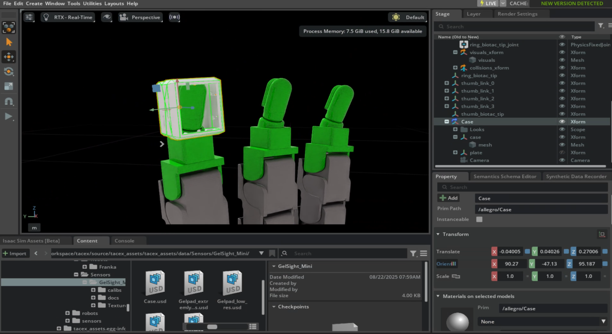
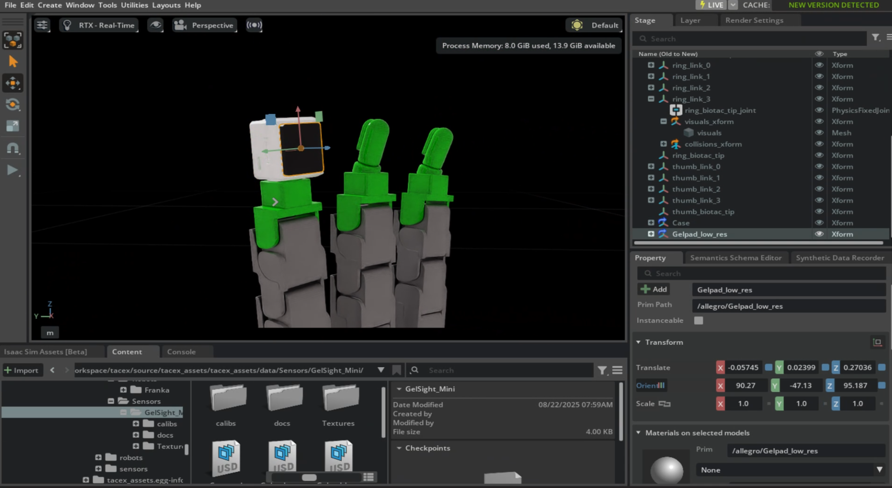

So, how do we actually use tactile sensors in Isaac Lab via TacEx?

In general you need to
- use a robot asset with the sensor models
- define your sensor config
    - here you can use preconfigured configs (see `source/tacex_assets/tacex_assets/sensors/gelsight_mini` directory) or
    - define everything yourself (i.e. what sort of optical/marker simulation, what the resolution should be etc -> [see other Tutorial]).

>[!NOTE]
> Depending on the tactile simulation you have different limitations.
> For more details see [Reference Table].
> The GPU based taxim approach with phyx rigid bodies works with Isaac Lab and can be used for direct and manager based workflow.
> The UIPC simulation currently only works with a direct workflow and requires the use of `UipcRLEnv` (instead of the default `DirectRLEnv`).

In the following examples that show how we add GelSight sensors existing  environments of Isaac Lab.

The full envs can be found in `tacex/source/tacex_tasks/tacex_tasks`.

# Direct Workflow

The Direct workflow allows for more flexibility in the implementation details.
Right now, the UIPC simulation is only implemented for the direct workflow.

This example showcases how existing `Factory` environments from Isaac Lab can be adjusted to include GelSight sensors.
The full env can be found in `source/tacex_tasks/tacex_tasks/factory`.
Here is quick rundown for how the environments can be created:
- copy the factory task folder from `IsaacLab/source/isaaclab_tasks/isaaclab_tasks/direct/factory` into `tacex/source/tacex_tasks/tacex_tasks`
- adjust the `factory_env_cfg.py`:
  - add an import: `from tacex_assets import TACEX_ASSETS_DATA_DIR`
  - change the spawn config of the robot to use our robot with GelSight Mini's: `usd_path=f"{TACEX_ASSETS_DATA_DIR}/Robots/Franka/GelSight_Mini/Gripper/physx_rigid_gelpads.usd",`
  - add configs for the tactile sensors:
```python
    gsmini_left = GelSightMiniCfg(
        prim_path="/World/envs/env_.*/Robot/gelsight_mini_case_left",
        sensor_camera_cfg = GelSightMiniCfg.SensorCameraCfg(
            prim_path_appendix = "/Camera",
            update_period= 0,
            resolution = (32,32),
        ),
        device = "cuda",
        debug_vis=True, # for rendering sensor output in the gui
        # update Taxim cfg
        marker_motion_sim_cfg=None,
        data_types=["tactile_rgb"], #marker_motion
    )
    # settings for optical sim
    gsmini_left.optical_sim_cfg = gsmini_left.optical_sim_cfg.replace(
        with_shadow=False,
        device="cuda",
        tactile_img_res=(32, 32),
    )
    gsmini_right = gsmini_left.replace(
        prim_path="/World/envs/env_.*/Robot/gelsight_mini_case_right",
    )
```

- register the env's by adjusting `__init__.py`:
  - id=`TacEx-Factory-PegInsert-Direct-v0`,
  - entry_point=`f"{__name__}.factory_env:FactoryEnv"`


- spawn the sensors by adding this to `_setup_scene()` method of `factory_env.py`
```python
        # sensors
        self.gsmini_left = GelSightSensor(self.cfg.gsmini_left)
        self.scene.sensors["gsmini_left"] = self.gsmini_left

        self.gsmini_right = GelSightSensor(self.cfg.gsmini_right)
        self.scene.sensors["gsmini_right"] = self.gsmini_right

```

You can train the environments via:
> Call from source dir of the TacEx repo

- `isaaclab -p ./scripts/reinforcement_learning/rl_games/train.py --task TacEx-Factory-PegInsert-Direct-v0 --num_envs 206 --enable_cameras`
- `isaaclab -p ./scripts/reinforcement_learning/rl_games/train.py --task TacEx-Factory-GearMesh-Direct-v0 --num_envs 206 --enable_cameras`
- `isaaclab -p ./scripts/reinforcement_learning/rl_games/train.py --task TacEx-Factory-NutThread-Direct-v0 --num_envs 206 --enable_cameras`

# Manager Based Workflow

This tutorial showcases how TacEx can be used with the Manager-Based workflow of Isaac Lab and how an asset can be adjusted to include tactile sensors.

We will adjust the [inhand_manipulation environment of IsaacLab](https://github.com/isaac-sim/IsaacLab/blob/main/source/isaaclab_tasks/isaaclab_tasks/manager_based/manipulation/inhand/inhand_env_cfg.py) and use an Allegro Hand with GelSight Minis as fingertips.

## Creating an Allegro Hand with GSmini's

In this part of the tutorial, we will make some (rough) adjustments to the robot hand asset by adding GelSight Minis to it.
We will just put them on the BioTac fingertips and add `FixedJoints`.
Its not really realistic, but should be enough for our purposes here.

- go to the Isaac Lab assets tab
- open the `Allegro hand` as file
- save it in a different directory
- open the TacEx asset folder with the GelSight Mini assets
- spawn a GelSight Mini case via drag-and-drop
- place it on top of a finger and adjust the rotation
    - for a good initial pose, select `ring_link_3` and use the same translation/orient values for the case
    - after setting the initial values, select the case Xform and press `E` twice to go into local-mode, then adjust the rotation
    - then `W` twice to adjust the position
> Note: Its important, that you always select the Xform for moving the asset parts.




- now spawn in a gelpad asset (just drag-and-drop again)
- click on the Xform of the gelpad and add the `Rigid Body with Colliders Preset` property, to make it a rigid body
- adjust the pose like we did for the sensor case (now you can use the translation/orient values of the sensor case as a reference)



- rename the GelSight Mini parts to match the finger (e.g. "Case_ring_3" and "Gelpad_ring_3").

Time to attach the sensor parts to the hand via fixed joints:
- select gelpad Xform and then also the case Xform
- right click and create a fixed joint
- rename the joint to match the assets ("case_gelpad_middle")

- then select case + ring_link_3 and create a fixed joint for them (name it "ring_case")

In the end, toggle this property on to prevent the mesh from getting in the way of the sensor camera


- Press play to check if it works (i.e. the parts do not fall apart)
    - note: you can use the Robot Assembler (`Tools -> Robotics -> Asset Editors -> Robot Assembler`) for more through testing

Now we need to add sensors to all the other fingers:
- duplicate the Case and the Gelpad
    - delete the fixed joint, since we define new ones
- adjust the translation/orientation
- add FixedJoints
- rename the joints
- repeat for all the other fingers

Note: As you might have realized, the placement of the sensors here is very rough. But its a quick way to quickly create a prototype.

## Adjusting the ManagerBased Environment
The Taxim and FOTS simulation can be used inside the Manager-Based workflow.

We copy the [inhand_manipulation environment](https://github.com/isaac-sim/IsaacLab/blob/main/source/isaaclab_tasks/isaaclab_tasks/manager_based/manipulation/inhand/inhand_env_cfg.py) of Isaac Lab and adjust it to include our tactile simulation.  
> You can find the adjusted environment at `source/tacex_tasks/tacex_tasks/inhand`.

First, we need to add the sensors to the `InHandObjectSceneCfg` class in the `inhand_env_cfg.py` file:
```python
    # GelSight Minis
    gsmini_ring: GelSightSensorCfg = MISSING
    gsmini_middle: GelSightSensorCfg = MISSING
    gsmini_index: GelSightSensorCfg = MISSING
    gsmini_thumb: GelSightSensorCfg = MISSING
```
The specific config files are added in `source/tacex_tasks/tacex_tasks/inhand/config/allegro_hand/allegro_env_cfg.py`, i.e. after the robot config was set.
> We need to set it after the robot config was set, since we need the robot prim_path for our sensor config.
```python
    from tacex_assets import GELSIGHT_MINI_TAXIM_FOTS_CFG
    # GelSight Minis
    gsmini_ring = GELSIGHT_MINI_TAXIM_FOTS_CFG.replace(
        prim_path="{ENV_REGEX_NS}/Robot/Case_ring_3",
        debug_vis=True,
    )
    # add FrameTransformer for FOTS simulation
    gsmini_ring.marker_motion_sim_cfg.replace(
        frame_transformer_cfg=FrameTransformerCfg(
            prim_path="{ENV_REGEX_NS}/Robot/Gelpad_ring_3",
            target_frames=[FrameTransformerCfg.FrameCfg(prim_path="{ENV_REGEX_NS}/object")],
            debug_vis=False,
        ),
    )
  # Do this for the 3 other fingers too...
```
- we use the preconfigured configuration file for Taxim and FOTS simulation
- we also setup a `FrameTransformer` for FOTS, which takes the gelpad path and the object path. This is required to compute the relative transformation between the gelpad and object.

We also need to adjust the `__init__.py` file in `source/tacex_tasks/tacex_tasks/inhand/config/allegro_hand/` to register our modified environment:
```python
gym.register(
    id="TacEx-Repose-Cube-Allegro-v0",
    entry_point="isaaclab.envs:ManagerBasedRLEnv",
    disable_env_checker=True,
    kwargs={
        "env_cfg_entry_point": f"{__name__}.allegro_env_cfg:AllegroCubeEnvCfg",
        "rsl_rl_cfg_entry_point": f"{agents.__name__}.rsl_rl_ppo_cfg:AllegroCubePPORunnerCfg",
        "rl_games_cfg_entry_point": f"{agents.__name__}:rl_games_ppo_cfg.yaml",
        "skrl_cfg_entry_point": f"{agents.__name__}:skrl_ppo_cfg.yaml",
    },
)
```

Furthermore, we include the mean (x,y) positions of the marker displacements in the observations. For this, we adjust the `source/tacex_tasks/tacex_tasks/inhand/mdp/observations.py` file with a custom ObservationTerm function:
```python
def mean_marker_motion(env: ManagerBasedRLEnv) -> torch.Tensor:
    """Mean (x,y) of the initial and current tactile marker displacements."""

    gsmini_ring: GelSightSensor = env.scene["gsmini_ring"]
    marker_motion_data = gsmini_ring.data.output["marker_motion"]
    x_mean_ring = torch.mean(marker_motion_data[:, :, :, 0], dim=2)
    y_mean_ring = torch.mean(marker_motion_data[:, :, :, 1], dim=2)

    gsmini_middle: GelSightSensor = env.scene["gsmini_middle"]
    marker_motion_data = gsmini_middle.data.output["marker_motion"]
    x_mean_middle = torch.mean(marker_motion_data[:, :, :, 0], dim=2)
    y_mean_middle = torch.mean(marker_motion_data[:, :, :, 1], dim=2)

    gsmini_index: GelSightSensor = env.scene["gsmini_index"]
    marker_motion_data = gsmini_index.data.output["marker_motion"]
    x_mean_index = torch.mean(marker_motion_data[:, :, :, 0], dim=2)
    y_mean_index = torch.mean(marker_motion_data[:, :, :, 1], dim=2)

    gsmini_thumb: GelSightSensor = env.scene["gsmini_thumb"]
    marker_motion_data = gsmini_thumb.data.output["marker_motion"]
    x_mean_thumb = torch.mean(marker_motion_data[:, :, :, 0], dim=2)
    y_mean_thumb = torch.mean(marker_motion_data[:, :, :, 1], dim=2)

    mean_curr_marker = torch.cat(
        (
            x_mean_ring,
            y_mean_ring,
            x_mean_middle,
            y_mean_middle,
            x_mean_index,
            y_mean_index,
            x_mean_thumb,
            y_mean_thumb,
        ),
        dim=-1,
    )

    return mean_curr_marker
```
and use this in the environment config `source/tacex_tasks/tacex_tasks/inhand/inhand_env_cfg.py`:
```python
    @configclass
    class TactileObsGroupCfg(KinematicObsGroupCfg):
        """Observations with full-kinematic state information and tactile data.

        This does not include acceleration or force information.
        """
        mean_curr_marker = ObsTerm(func=mean_marker_motion)

        def __post_init__(self):
            # call parent post init
            super().__post_init__()
            self.enable_corruption = True
            self.concatenate_terms = True
```

You can start the training by running
```bash
python scripts/reinforcement_learning/skrl/train.py --task=TacEx-Repose-Cube-Allegro-v0 --headless --enable_cameras
```

If you want to see the debug_visualization (when you set `debug_vis=True` in the sensor cfg):
- click on a sensor case Xform (e.g. `/World/envs/env_0/Robot/Case_ring_3`)
- click on the `Property` Tab and scroll down to `Raw USD Properties/Extra Properties`
- toggle on `debug_marker_motion`

---

Now you know how to
- initialize tactile sensors
- use FOTS/Taxim simulation approach
- get the sensor output for observations

in the Manager-Based workflow.

> Note:
> This environment probably won't train properly, since the observation space is so big.
> We also cannot use many robot hands in parallel with the FOTS simulation (not vectorized yet). The original environment uses 8000 robot hands, while we simulate about 50.
> Additionally, we do not include the sensor information in the reward function.
> Here it might be beneficial to have a `in_contact` reward, or something like this.
>
> Right now its really just a showcase for how TacEx could be used in the Manager-Based workflow.
